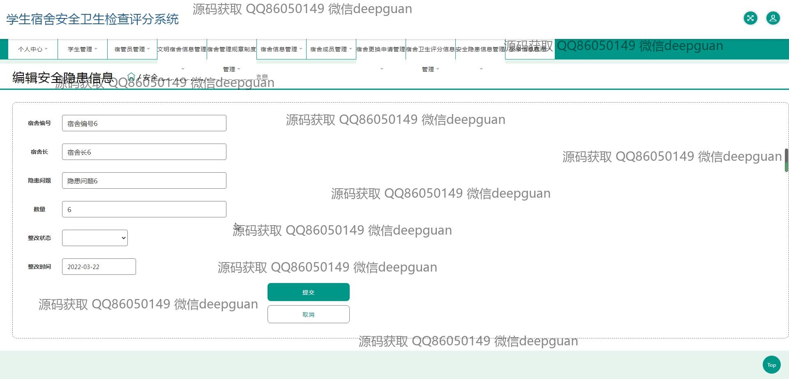

<h1 align="center">“智慧食堂”设计与实现</h1>

## 简介
智慧食堂系统：角色分为管理员、学生、宿管员；功能包括在线点餐、菜单浏览、订单管理、支付系统，支持信息查询、编辑和宿舍安全卫生管理，优化食堂运营，提升用户体验。    --计算机毕业设计源码；毕设源码；java毕业设计源码

## 联系方式

<h3 align="center">获取完整代码与数据库文件 + 微信：deepguan QQ: 86050149 QQ群: 783742310</h3>

<h3 align="center">可帮忙远程部署 包运行成功！提供远程部署、修改代码、设计文档指导、代码讲解等服务！</h3>

## 功能介绍（完整见运行截图）
管理员：管理员可以通过登录界面进入系统，具备添加、修改和删除学生信息以及宿舍信息的权限。他们可以编辑宿管员及自身信息，管理宿舍卫生评分数据，监控宿舍安全隐患及整改状态。管理员还拥有批量操作选项，如批量删除与添加，并能查看宿舍成员详情，管理宿舍报修信息，以及处理宿舍更换申请。系统提供丰富的功能模块，支持多角色管理和用户反馈处理。

学生：学生可在系统中通过身份选择进行登录，查看和管理个人信息，浏览宿舍安全与卫生评分详情。他们能够申请换宿舍，提交维护申请，查看个人选择宿舍的成员及信息。学生可通过搜索功能快速查询宿舍数据，以及查看或修改自己的信息，仅限于个人部分。系统支持学生浏览每日菜品，进行餐品预订，并查看历史订单，提供用户反馈及意见提交功能。

宿管员：宿管员根据分配的权限登录系统，可以编辑宿舍成员信息，管理宿舍安全与卫生评分，查看宿舍隐患问题以及整改措施。他们有权处理宿舍维护申请，管理宿舍更换申请，并能查看宿舍详细资料。宿管员也可以更新个人资料及上传头像。系统提供一个集中化平台，简化宿舍管理，提升运营效率，确保安全卫生达标。

智慧食堂用户：智慧食堂用户通过系统登录，具备查看每日菜品信息、在线点餐、管理订单及支付的功能。他们可以通过界面进行餐品预订，支付并查看订单历史记录及食品评价。系统实时报价及更新订单状态，优化食堂运行流程。此外，用户反馈功能使得用户可以对服务及餐品进行评价，帮助提升整体用餐体验，推动食堂管理不断改进和优化。

## 运行截图

本代码来源于网络,仅供学习参考使用!

